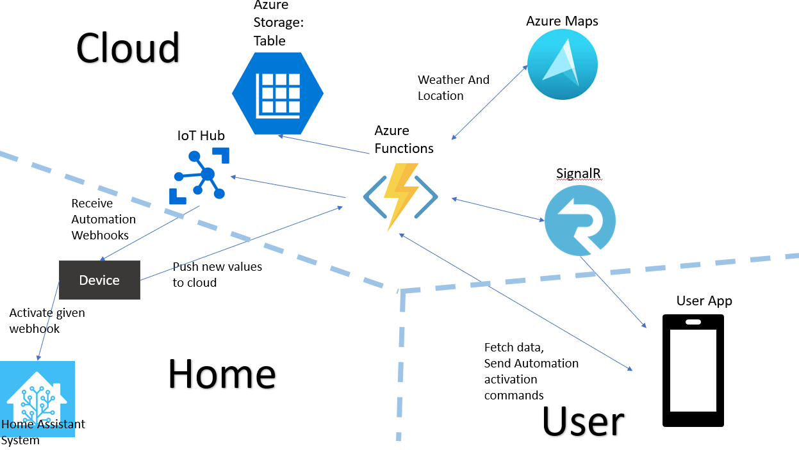

# Weather Hub

The project gives the user the ability to control and monitor climate at multiple properties remotely through an app, all at one place - concentrated.

## How Does It Work ?

Connect your device to the WiFi network where your Home Assistant System is located.

Creating an account is done through the app.
Each device comes with a unique number, enter the serial number and friendly name to register the new device.
Through the device's settings manage location, activity hours and boundry temperatures, enter a turn on/off webhooks specific to the device.
In the automations page: press an automation to activate it. The app will activate a function which in turn will send a webhook to your device which will send an http request to activate an automation through the said webhook.

## Features:

* Track weather measurements on several properties locations on the same app.
  - Temperature
  - Humidity

* Enables The user to save energy through managing and controlling the property's AC system (through communication with a home assistant system).
  - Set activity hours for the AC system.
  - Set boundry temperatures for turning the AC on/off.

* Get notified when weather changes:
  - When precipitations status changes.
  - When the boundry temperatures that were set were reached.

* Activate automations on your home assistant system.
  - Store specefic automations for turning AC on/off.
  - Store more automations locally on your phone, for activating remotely.
 
## The Device

* ESP8266 Board (With WiFi Antenna).
* BMP280 Temperature and Air Pressure measure.

## Services Used

* ### Azure IoT Hub
  For managing cloud to device messages.
  
* ### Azure Functions
  - #### HTTP Trigger
    For activating most of the functions
  - #### Event Grid Trigger
    For activating an automation through another function.
  - #### Timer Trigger
    For supporting the automatically managed AC activity hours.
    
* ### Azure signalR Service
  For syncing the information received on the app with the information stored on the cloud. Received immediate notification on extreme conditions measured by the device.
  
* ### Azure Storage : Data Tables
  For Storing data.
  
* ### Event Grid
  An Event Grid topic to activate an azure function.

* ### Azure Maps
  Getting coordinates for given address, and getting current weather conditions at said coordinates.

## Architecture

